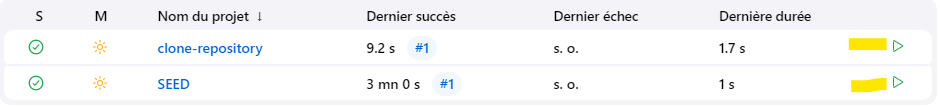

# Jenkins Configuration as Code (JCasC)

## Quick start

1. Run docker-compose  
   `docker-compose up`

2. Open Jenkins  
   🌐 http://localhost:8080/

3. Log in with an account

   Use one of the following accounts to access Jenkins

   | Username        | Login           | Password    | Role / Rights       |
   | --------------- | --------------- | ----------- | ------------------- |
   | Administrator   | `system_admin`  | password123 | Full access (admin) |
   | Security Team   | `security_team` | password123 | Reading + building  |
   | DevOps Engineer | `devops_user`   | password123 | Complete CI/CD      |
   | Guest           | `guest`         | password123 | Reading only        |

4. Launch jobs with `system_admin`'s admin account

   

## Overview

This project sets up a preconfigured Jenkins instance with JCasC and Job DSL.  
It contains a `Tools` folder in Jenkins with **2 jobs**:

- `clone-repository`: Allows you to clone a Git repository by simply providing its URL
- `SEED`: Dynamically generates a Jenkins job from a GitHub repository (e.g. `me/my-project`).   
The created job:
  - Uses the repository as a Git source
  - Runs a sequence of `make` commands (`fclean`, `make`, `tests_run`, `clean`)
  - Automatically updates itself via an SCM trigger every minute

This project is designed for developers or DevOps teams looking to quickly automate Jenkins configuration and job deployment.
